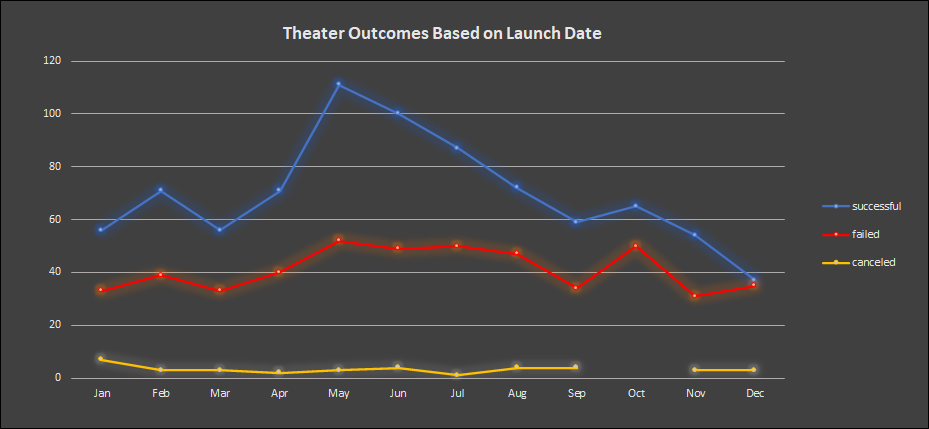
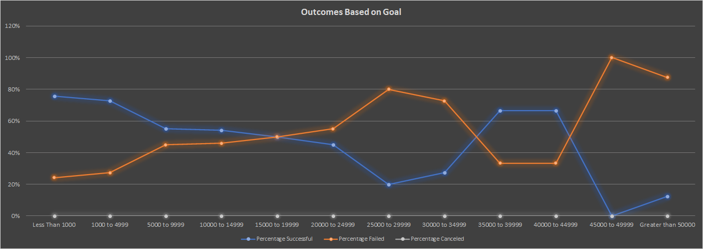

# Kickstarting with Excel

## Overview of Project

This is an analysis of filtered data from theater and plays campaigns on Kickstarter. The targeted outcomes are to find an optimal launch date and monetary goal amounts for a successful theater campaign launch on Kickstarter.

### Purpose

The analysis answers two key questions when creating a new theater and plays campaign on Kickstarter. Both, when is the best month to launch the campaign, and what is the optimum range for the monetary goal amount? The data is broken down into two categories theater outcomes vs launch dates and plays outcomes vs goal amount. 

## Analysis and Challenges

The main challenge with this analysis is filtering the relevant data. The analysis only called for relevant campaign data to theater/play categories/subcategories, but the data sets contained vast rages of categories/subcateries. The analysis’s purpose is to answer two key questions; (1) when is the best month to launch a theater/play campaign? (2) what is the optimum range for a monetary goal amount for a theater/play campaign on Kickstarter? So, the data is filtered to only show theater category and plays subcategory. Another challenge is the format of certain data sets such as dates that were formatted using [Epoch Converter.](https://www.epochconverter.com/)
From this point, the sorted data was transferred into pivot tables and charts to be visualized.

### Analysis of Outcomes Based on Launch Date

The data on the chart “Theater Outcomes Based on Launch Dates” presents a count of the successful, failed, and canceled theater campaigns category based on monthly launch date. The chart layout represents the value or the count of campaigns on the left vertical axis. On the bottom horizontal axis the months are represented, starting from January on the bottom left; ending with December on the bottom right. The blue plotted line on the chart is representative of the successful campaigns. The red plotted line on the chart is representative of failed campaigns. And, the yellow plotted line on the chart is representative of canceled campaigns. The average count of successful campaigns within the 12 months is about 70 campaigns. Another data point represented in this chart is that the number of successful campaigns is not evenly distributed. The number of successful campaigns peak in May and begin to dip to the lowest count taking place in December. The count of failed campaigns within the 12 months follows a similar but flattened trend as the successful campaign. The average count of failed campaigns for the 12 months is about 41 campaigns. The peak of failed campaigns also follows a similar trend to successful campaigns, they both peak in May. The second peak in failed campaigns is in October. The October failed peak is interesting because although it can be explained by the declining number of successful campaigns after the May peak, failed campaigns seem to be affected disproportionately. The average count of canceled campaigns is about 3 campaigns over 12 months. The line chart also represents the count of canceled campaigns peaking in January. October is also interesting for canceled campaigns because there are no cancelations during October But the count of successful campaigns is declining and the number of failed campaigns are rising.

### Analysis of Outcomes Based on Goals

The data presented on the chart “Outcomes Based on Goals” is a percentage of successful, failed, and canceled Plays campaigns subcategory based on the monetary range of the Goal amount. The chart layout represents the Percentage of successful, failed, and canceled campaigns on the left vertical axis. On the bottom horizontal axis, the chart is representing the monetary range of the goal amount. Starting on the bottom left from less than 1,000 to more than 50,000 on the far bottom right. The blue plotted line on the chart is representative of the percentage of successful campaigns based on goal amounts. The orange plotted line on the chart is representative of the percentage of failed campaigns based on goal amounts. The silver plotted line on the chart is representative of canceled campaigns based on goal amounts. There is a strong trend between successful and failed campaigns displayed by the chart “Outcomes Based on Goals”. The successful campaign trends are tied to failed campaigns; as the percentage of successful campaigns starts to drop the percentage of failed campaigns will increase. There were similar trends or some relation between successful and failed campaigns on the previous chart “Theater Outcomes Based on Launch Dates” but not so tightly correlated as in this chart. Another data point this chart suggests is that higher goal amounts have a lower percentage of success.  

### Challenges and Difficulties Encountered

Formating the data to obtain results for the chart “Outcomes Based on Goals” was challenging due to the range of monetary goal amounts. Using the formula [=countifs] was a difficulty encountered! I realized how valuable VBA is when many changing arguments are present. The solution was to create a new worksheet with references for the arguments. Finally, self-reference the formula with the “find and replace” option.

## Results

- What are two conclusions you can draw about the Outcomes based on Launch Date?

- What can you conclude about the Outcomes based on Goals?

- What are some limitations of this dataset?

- What are some other possible tables and/or graphs that we could create?
